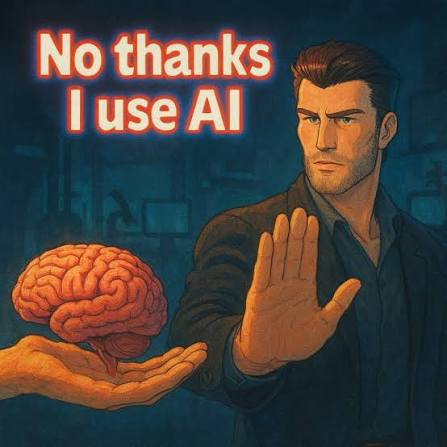

## 🧠 AI Агент, который учится за тебя

> Это промпт для автосборки локального “второго мозга”, куда можно складывать материалы, а потом просить AI отвечать или сделать проект по этой базе с источниками. Мне благодаря этому очень удобно брать английские гайды/курсы с YouTube, загружать ссылки в AI агента - после этого делая проект с нужными знаниями

!
    
## 🔥 Возможности

1) Заставляет AI не объяснять, а самостоятельно создать проект в текущей папке.
2) Создаёт структуру папок для входящих файлов, оригиналов, извлечённого текста, summaries, wiki, индексов, персон и отчётов.
1) Требует написать рабочий CLI scripts/kb.py, а не заглушку.
4) CLI должен уметь добавлять YouTube, PDF, HTML, TXT, 
5) Markdown, DOCX, видео/аудио и целые папки курсов.
6) Для каждого материала база сохраняет оригинал, извлекает текст, создаёт summary, JSON manifest и обновляет индексы.
7) Создаёт .venv, ставит зависимости: yt-dlp, pypdf, beautifulsoup4, python-docx, markdownify.
9) Если зависимости не ставятся, включает fallback на стандартной библиотеке Python и всё равно продолжает.
9) Обязательно запускает smoke-тесты: init, status, импорт тестовых TXT/HTML, process, rebuild-index, search.
10) Создаёт README.md, AGENTS.md, personas и стартовую wiki-страницу.
11) В конце должен дать только короткий отчёт: где проект, что готово, что проверено и как пользоваться.

## 🛠 Требования

Python 3.10+
AI-инструмент с агентным режимом: OpenAI Codex CLI, Cursor, Claude Code, Cline или аналог
~70k токенов контекста для первичного развёртывания

## 🦾 ГЛАВНАЯ ПОЛЬЗА:

1) Не терять материалы: всё сохраняется в одной структуре.
2) Быстро понимать суть: база делает summary и вытаскивает текст.
3) Искать по материалам локально: например search "Hermes" или search "freelance".
4) Спрашивать Codex по своей базе: не “вообще из интернета”, а по твоим сохранённым источникам.
5) Строить второй мозг: wiki, индексы, summaries, темы, глоссарий.
6) Хранить оригиналы безопасно: sources/ не удаляются без прямой команды.
7) Загружать целые курсы папкой и потом ориентироваться в них через manifest и summary.

## 🚀 Установка 
1) Создаешь отдельный проект, где ведешь диалог с AI (в IDE/CHAT)
2) Загрузи промт в диалог и отправь:
    "Разверни полностью самостоятельно всю базу четко по инструкции."
3) После загрузки промта в папке появятся файлы - ваш AI с личной базой данных готов. Можете его кормить

## 📂 Структура проекта

Ai_Knowledhe_Base/
├── Agents.md/         
├── extrcts/       
├── inbox/       
├── index.md/            
├── indexes/         
├── knowledge/        
├── personas/         
├── projects/
├── README.md
├── requirements.txt   
├── scripts
└── sources

**FAQ:** 
У меня в Codex установка промта съела 61к токенов. Если база данных будет расти - промт не начнет есть больше контекста. Экономия контекста работает благодаря индексам, summaries, manifests и поиску. Агент сначала читает маленькие “карты”, а потом открывает только нужный файл.

## 📄 Лицензия
MIT - используй как хочешь.